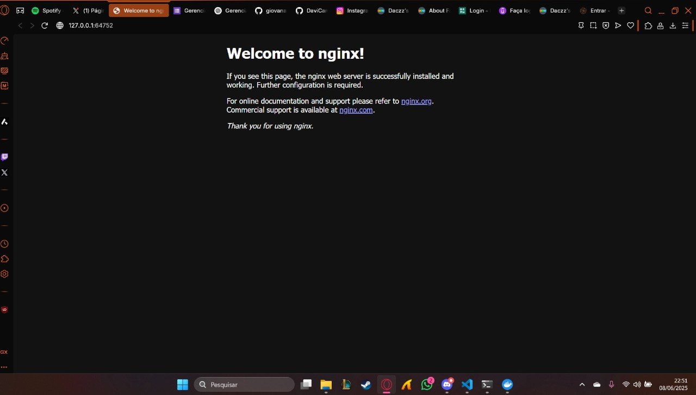
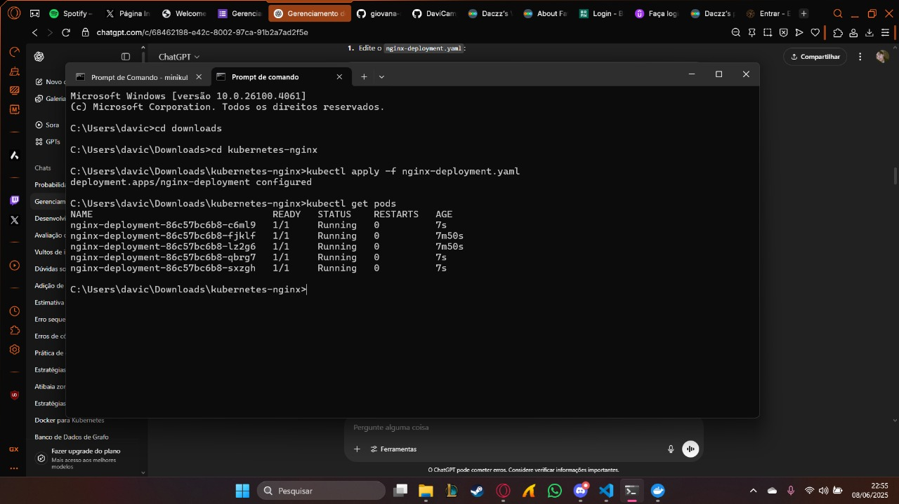

# Exercício: Gerenciando Aplicações com kubectl

Este repositório contém os arquivos e instruções para implantar, escalar e gerenciar uma aplicação Nginx em um cluster Kubernetes local utilizando o Minikube e o kubectl.

## ✅ Objetivo

Demonstrar o uso de arquivos YAML para criar um Deployment e um Service para o Nginx, além de manipular réplicas, acessar a aplicação, visualizar logs e limpar os recursos criados.

---

## 🛠️ Pré-requisitos

Antes de iniciar, certifique-se de ter instalado:

- [Minikube](https://minikube.sigs.k8s.io/docs/start/)
- [kubectl](https://kubernetes.io/docs/tasks/tools/)
- Git (para clonar ou subir o repositório)
- Navegador ou terminal com `curl` para testar a aplicação

---

## ▶️ Instruções de Uso

### 1. Inicie o Minikube
```bash
minikube start

2. Verifique o cluster
bash
Copiar
Editar
kubectl cluster-info


3. Implante a aplicação Nginx
bash
Copiar
Editar
kubectl apply -f nginx-deployment.yaml
kubectl get deployments
kubectl get pods


4. Crie o serviço do tipo NodePort
bash
Copiar
Editar
kubectl apply -f nginx-service.yaml
kubectl get services


5. Acesse a aplicação
Obtenha a URL:
bash
Copiar
Editar
minikube service nginx-service --url
Acesse no navegador ou via curl:
bash
Copiar
Editar
curl http://127.0.0.1:PORTA


6. Escale a aplicação para 5 réplicas
Edite nginx-deployment.yaml e altere replicas: 2 para replicas: 5

bash
Copiar
Editar
kubectl apply -f nginx-deployment.yaml
kubectl get pods


7. Reduza a aplicação para 1 réplica
Edite novamente nginx-deployment.yaml e defina replicas: 1

bash
Copiar
Editar
kubectl apply -f nginx-deployment.yaml
kubectl get pods


8. Verifique os logs de um pod
bash
Copiar
Editar
kubectl get pods
kubectl logs <nome-do-pod>


9. Limpe o ambiente
bash
Copiar
Editar
kubectl delete -f nginx-service.yaml
kubectl delete -f nginx-deployment.yaml
kubectl get deployments
kubectl get services


🖼️ Imagens
Página do Nginx no navegador:




### 5 Pods em execução:


📁 Estrutura do Repositório
Copiar
Editar
.
├── nginx-deployment.yaml
├── nginx-service.yaml
├── imagens/
│   ├── nginx-navegador.png
│   └── nginx-pods-5.png
└── README.md
yaml
Copiar
Editar

---

#